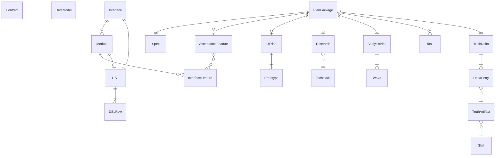

{/* Generated by `modelith render`. Do not edit by hand; edit the .modelith.yaml source and re-render. */}

# aixbdd — AI × BDD Workflow

The canonical domain model of the AIxBDD development workflow: how a `PlanPackage` travels from PM-defined acceptance Gherkin through system analysis and truth artifacts to executable BDD tasks and implementation — with exactly one authoritative owner per truth specification and a per-package truth-delta ledger.

## Glossary

- **`Example`** — One concrete data-situation block under a `Rule`: a Given/When/Then journey describing premise, behavior, and expected outcome, judgeable as pass or fail.
- **`PM`** — The product role that owns requirements: runs the specify, spec-by-example and UI-plan skills, reviews the resulting artifacts, and defines what counts as passing acceptance.
- **`RD`** — The engineering role that turns accepted requirements into system design and working code: runs the research, analysis, planning, truth-owner and implementation skills.
- **`Rule`** — An atomic business-rule block inside a Gherkin feature; its `Example`s exercise exactly that rule and nothing broader. Used by both acceptance and interface features.

## Enums

### `DeltaAction`

The action a `DeltaEntry` reports for a truth specification.

| Value | Definition |
| --- | --- |
| `add` | The truth specification was created this round. |
| `modify` | The truth specification was changed this round. |
| `delete` | The truth specification was removed this round. |
| `noop` | The truth area was checked against the round's changes and needed no change — recorded to prove the check happened. |

### `InterfaceKind`

The system boundary an `Interface` structures.

| Value | Definition |
| --- | --- |
| `backend` | The API boundary — executable truth lives under `features/backend/**`. |
| `frontend` | The web UI boundary — executable truth lives under `features/frontend/**`. |

### `PlanStatus`

The lifecycle state of a `PlanPackage`.

| Value | Definition |
| --- | --- |
| `active` | The package is being produced — artifacts are still being written and reviewed. |
| `delivered` | The package is frozen history — all tasks are done and verified; later rounds never modify it. |

## Entities

### `AcceptanceFeature`

A PM-readable Gherkin file (`features/acceptance/*.feature`) expressing the round's acceptance journeys as Rules and Examples in business language. It contains no technical detail and no front/back-end split — those are introduced later by axb-dsl-refine. It is the authoritative acceptance contract the implementation is built against.

**Relationships**

- `InterfaceFeature` — n:n — referenced — axb-dsl-refine splits acceptance journeys into executable interface features; coverage requires every acceptance rule to be carried by at least one.

**Invariants**

- **acceptance-business-language** — An `AcceptanceFeature` uses business language only — no API, selector, or other technical detail, and no front/back-end split.
- **acceptance-atomic-rules** — Each `Rule` in an `AcceptanceFeature` is atomic; an Example title that reads like another rule means the rule must be split.

### `AnalysisPlan`

The system-analysis artifact (`plan.md`) produced by axb-system-analysis: the inventory of system interfaces, their classification, and the dependency-ordered `Wave`s that delegate each interface to the appropriate planner skills. It never redefines truth — it orchestrates who analyses what, in what order.

**Relationships**

- `Wave` — 1:1..n — owned

**Invariants**

- **analysis-plan-never-writes-truth** — An `AnalysisPlan` orchestrates analysis only; it never creates or modifies a `TruthArtifact`.
- **wave-covers-interfaces** — Every interface identified by an `AnalysisPlan` is delegated to a planner in at least one `Wave`.

### `Contract`

The canonical API contract truth (`specs/truth/contracts/**`, OpenAPI 3.0): operations, schemas, responses, and the error model of the system's API surface. Owned by axb-api-plan and produced when an `AnalysisPlan` wave delegates an API interface.

**Subtype of** `TruthArtifact`

**Invariants**

- **contract-authoritative** — The system's API surface is defined only in the `Contract`; no other artifact specifies API behavior.

### `DSL`

A DSL vocabulary file (`dsl.md`) mapping Gherkin sentence patterns to their implementation contracts: parameters, DataTable support, defaults, and implementation semantics. It exists at two authority levels — the `Interface` root for cross-module rows and the `Module` level for module-specific rows — and each sentence pattern has exactly one authoritative row in this hierarchy.

**Subtype of** `TruthArtifact`

**Relationships**

- `DSLRow` — 1:1..n — owned

**Actions**

- `move_row` — actor `Skill`; preserves dsl-single-authority, dsl-exact-one-match — Move a `DSLRow` between the interface-root and module authority levels when usage changes; the row's semantics stay unchanged.

**Invariants**

- **dsl-single-authority** — A sentence pattern has exactly one authoritative `DSLRow` — either at the `Interface` root or in a `Module`, never duplicated across levels.

### `DSLRow`

One authoritative entry in a `DSL`: a single sentence pattern with its Gherkin parameters, DataTable contract, default parameters, and implementation semantics. When reading a feature, the interface-root and module `DSL`s are merged, and every step must hit exactly one row — zero is a missing specification, more than one is a duplicate authority.

**Attributes**

| Name | Type | Description |
| --- | --- | --- |
| `pattern` | string | The Gherkin sentence pattern this row authoritatively defines. |

**Invariants**

- **dsl-exact-one-match** — Merging the interface-root and module `DSL`s, every step of a feature must match exactly one `DSLRow` — zero is a gap, more than one is an ambiguity.

### `DataModel`

The canonical data-model truth (`specs/truth/data/**`, DBML): tables, enums, relationships, and lifecycle rules of the system's persisted or in-memory state. Owned by axb-data-plan; it covers in-memory models as well as databases.

**Subtype of** `TruthArtifact`

**Invariants**

- **data-model-covers-all-state** — The `DataModel` covers every kind of system state, persisted and in-memory alike.

### `DeltaEntry`

One row in a `TruthDelta`: an action (add, modify, delete or noop) on a truth specification, with a change summary and a reason. Every truth owner records at least one entry per round — a noop entry proves a truth area was checked against the round's changes even when nothing needed to change.

**Relationships**

- `TruthArtifact` — n:1 — referenced — The truth specification this entry reports on.

**Attributes**

| Name | Type | Description |
| --- | --- | --- |
| `action` | DeltaAction | What happened to the truth specification this round. |
| `summary` | string | Semantic-unit-level description of the change. |
| `reason` | string | Why the change (or the noop) was warranted. |

**Invariants**

- **delta-entry-cites-truth** — Each `DeltaEntry` names the truth specification it reports on and carries a summary and a reason.

### `Interface`

A system boundary through which the software is exercised — backend (API) or frontend (web) — structuring the executable truth under `specs/truth/features/{interface}/`. Interface-level Gherkin and DSL live only inside an `Interface`; feature files are never placed directly at the truth root.

**Relationships**

- `Module` — 1:n — owned
- `DSL` — 1:0..1 — owned — The interface-root shared `DSL` holding rows used across modules; present only when such shared rows exist.

**Attributes**

| Name | Type | Description |
| --- | --- | --- |
| `kind` | InterfaceKind | Which boundary this `Interface` structures. |

**Invariants**

- **interface-features-nested** — Feature files live only inside a `Module`; an `Interface` root never contains feature files directly.

### `InterfaceFeature`

An executable Gherkin feature file in the truth tree (`specs/truth/features/{interface}/{module}/*.feature`) produced by axb-dsl-refine from the PM's acceptance criteria. Every acceptance rule must be carried by at least one `InterfaceFeature`, and each of its steps must match exactly one `DSLRow` in the merged lookup.

**Subtype of** `TruthArtifact`

**Invariants**

- **acceptance-coverage** — Every acceptance rule is carried by at least one `InterfaceFeature`.

### `Module`

A functional grouping (e.g. customer, opportunity, pipeline) inside an `Interface`. Modules carry the module's executable features and its own module-level `DSL`; module boundaries are reused from existing truth rather than invented per round.

**Relationships**

- `InterfaceFeature` — 1:n — owned
- `DSL` — 1:0..1 — owned — The module-level `DSL`; each `Module` has at most one.

**Attributes**

| Name | Type | Description |
| --- | --- | --- |
| `name` | string | Functional name of the grouping (e.g. customer, pipeline). |

**Invariants**

- **module-boundary-reuse** — Module boundaries are reused from existing truth; a round does not invent new `Module`s while a suitable one exists.

### `PlanPackage`

A numbered iteration container (`NNN-<slug>` under `specs/plans/`) that holds every artifact produced in one development round. Each new requirement starts a fresh `PlanPackage`; delivered packages are frozen history and are never modified by later rounds. There is no separate round concept — the package is the round.

**Relationships**

- `Spec` — 1:1 — owned
- `AcceptanceFeature` — 1:n — owned
- `UIPlan` — 1:0..1 — owned
- `Research` — 1:0..1 — owned
- `AnalysisPlan` — 1:0..1 — owned
- `Task` — 1:n — owned
- `TruthDelta` — 1:1 — owned

**Attributes**

| Name | Type | Description |
| --- | --- | --- |
| `number` | string | The zero-padded sequence number (`NNN`), unique across packages. |
| `slug` | string | Short kebab-case name of the round's theme. |
| `status` | PlanStatus | Whether the package is being produced or frozen as history. |

**Actions**

- `create` — actor `Skill`; preserves fresh-package-per-round — axb-specify creates the package with its `Spec`, requirements checklist, and `TruthDelta` skeleton.

**Invariants**

- **plan-package-frozen** — A delivered `PlanPackage` is frozen history: later rounds never modify its artifacts.
- **fresh-package-per-round** — Every new round starts a fresh `PlanPackage`; requirements are never re-opened inside an old package.

### `Prototype`

One static HTML screen of the mid-fidelity prototype produced from a `UIPlan`. Prototypes cover the flows defined by the acceptance Gherkin and are the PM's reviewable stand-in for the future UI. They are plan-side artifacts, never system truth.

**Invariants**

- **prototype-plan-side-only** — A `Prototype` is a plan-side artifact and never becomes a `TruthArtifact`.

### `Research`

The technical-decision artifact produced by axb-technical-research: candidate options, adoption and rejection reasons, risks, and the resulting technology choices. Each `Research` updates the current `Techstack` truth and is reviewed before that update is accepted.

**Relationships**

- `Techstack` — n:1 — referenced — Each `Research` updates the current `Techstack` truth.

**Invariants**

- **research-precedes-techstack** — A `Techstack` update is applied only after the `Research` producing it has been reviewed.

### `Skill`

One of the axb-* workflow skills — the executable SOPs of the methodology, each owning specific artifacts and phases. `Skill`s are the only writers of the artifacts they own; every other participant reviews or consumes their output.

**Attributes**

| Name | Type | Description |
| --- | --- | --- |
| `name` | string | Unique skill identifier (for example axb-specify, axb-bdd). |

**Invariants**

- **skill-scoped-writes** — A `Skill` writes only the artifacts it owns; changes outside its ownership are escalated, never made directly.

### `Spec`

The requirements artifact of a `PlanPackage`: user stories, acceptance criteria, boundaries, and a requirements checklist. Written by the `PM` via axb-specify and optionally refined through interactive clarification. It is the authority the `RD` side plans against, and is never edited by the `RD` side.

**Invariants**

- **spec-pm-authored** — Only the `PM` edits a `Spec`; the `RD` side escalates gaps through clarification instead of editing it.

### `Task`

One unit of work in a `PlanPackage`'s task list (`tasks.md`) produced by axb-tasks: test-alignment, feature green or refactor, code-removal, or regression work, each with an execution marker. axb-implement executes tasks in constraint-ordered batches, marking each done before starting the next.

**Attributes**

| Name | Type | Description |
| --- | --- | --- |
| `marker` | string | Execution marker driving how the task runs (for example test alignment, feature green, refactor, code removal, or regression). |
| `done` | boolean | Flipped to done only after the task's verification has passed. |

**Actions**

- `complete` — actor `Skill`; preserves task-strict-ordering — Mark a verified task done in the task list before the next batch starts.

**Invariants**

- **task-strict-ordering** — Implementation completes the current batch of `Task`s and marks them done before any later task starts; no task is skipped.

### `Techstack`

The canonical technology-stack truth (`specs/truth/techstack.md`): the complete, current technology choices of the system, not just the delta of the latest round. Owned by axb-technical-research and kept current through each round's `Research`.

**Subtype of** `TruthArtifact`

**Invariants**

- **techstack-complete** — The `Techstack` represents the complete current technology stack, not just the latest round's delta.

### `TruthArtifact`

The parent of every canonical truth specification under `specs/truth/**`: the single source of truth that always reflects the current system rather than any one round. Each `TruthArtifact` has exactly one owning skill that is the only writer allowed to change it; everyone else reads it or records proposed changes in the ledger.

**Subtypes** — `Contract`, `DSL`, `DataModel`, `InterfaceFeature`, `Techstack`

**Relationships**

- `Skill` — n:1 — referenced — Governance ownership — exactly one skill is the sole writer of this truth artifact.

**Attributes**

| Name | Type | Description |
| --- | --- | --- |
| `location` | string | Path under `specs/truth/**` where the artifact lives. |

**Invariants**

- **truth-single-owner** — Each `TruthArtifact` has exactly one owning `Skill`, which is the only writer allowed to change it.
- **truth-current** — A `TruthArtifact` always reflects the current system, never the view of a single round.

### `TruthDelta`

The per-`PlanPackage` ledger (`truth-delta.md`) recording every truth change of the round, with one section per truth owner. Initialized by axb-specify and appended by the truth-owner skills; packages of earlier rounds keep their ledgers frozen as history.

**Relationships**

- `DeltaEntry` — 1:1..n — owned

**Actions**

- `append_entry` — actor `Skill`; preserves delta-covers-all-owners — A truth owner records its round's entries — add, modify, delete, or noop — in its own section of the ledger.

**Invariants**

- **delta-covers-all-owners** — Every truth owner records at least one `DeltaEntry` per round; a noop entry satisfies this by proving the area was checked.

### `UIPlan`

The UX plan of a `PlanPackage`: screen inventory, flows, states, and error handling, produced by axb-ui-plan after the acceptance Gherkin is confirmed. Present only when the round involves a user-facing interface.

**Relationships**

- `Prototype` — 1:1..n — owned

**Invariants**

- **prototype-flows-cover-acceptance** — The `Prototype`s of a `UIPlan` cover the acceptance flows defined by the round's `AcceptanceFeature`s.

### `Wave`

A dependency-ordered group of planning work inside an `AnalysisPlan`. `Wave`s sequence the analysis so that shared interfaces are planned before the ones depending on them, and independent interfaces are grouped for parallel delegation.

**Attributes**

| Name | Type | Description |
| --- | --- | --- |
| `order` | integer | The wave's position in the dependency sequence; lower runs earlier. |

**Invariants**

- **wave-dependency-ordered** — A `Wave` is scheduled only after the `Wave`s it depends on have completed.

## Relationships

## Scenarios

### PM defines a round

A new requirement arrives; the `PM` runs the specify, spec-by-example and ui-plan skills to produce the round's plan-side artifacts for review.

**Actors:** PM, Skill

**Steps**

1. axb-specify creates a fresh `PlanPackage` with its `Spec` and `TruthDelta` skeleton.
2. The `PM` reviews the `Spec`: stories complete, criteria judgeable, boundaries covered.
3. axb-spec-by-example renders the acceptance criteria into `AcceptanceFeature`s in business language.
4. axb-ui-plan produces the `UIPlan` and its `Prototype`s covering the acceptance flows.
5. The `PM` confirms the Gherkin and prototypes — the round's acceptance contract is set.

**Invariants touched**

- **fresh-package-per-round** — Every new round starts a fresh `PlanPackage`; requirements are never re-opened inside an old package.
- **spec-pm-authored** — Only the `PM` edits a `Spec`; the `RD` side escalates gaps through clarification instead of editing it.
- **acceptance-business-language** — An `AcceptanceFeature` uses business language only — no API, selector, or other technical detail, and no front/back-end split.
- **acceptance-atomic-rules** — Each `Rule` in an `AcceptanceFeature` is atomic; an Example title that reads like another rule means the rule must be split.
- **prototype-flows-cover-acceptance** — The `Prototype`s of a `UIPlan` cover the acceptance flows defined by the round's `AcceptanceFeature`s.
- **prototype-plan-side-only** — A `Prototype` is a plan-side artifact and never becomes a `TruthArtifact`.

### RD plans the system

In parallel with the PM's later steps, the `RD` researches technology, then analyses the system and delegates each interface to a planner via ordered waves, producing the API and data truth.

**Actors:** RD, Skill

**Steps**

1. axb-technical-research writes the `Research` with options, reasons, and risks.
2. After review, the `Research`'s decisions are applied to the `Techstack` truth.
3. axb-system-analysis writes the `AnalysisPlan` and orders the work into `Wave`s.
4. A later `Wave` delegates the API interface; axb-api-plan produces the `Contract` truth.
5. A later `Wave` delegates the data interface; axb-data-plan produces the `DataModel` truth.

**Invariants touched**

- **research-precedes-techstack** — A `Techstack` update is applied only after the `Research` producing it has been reviewed.
- **techstack-complete** — The `Techstack` represents the complete current technology stack, not just the latest round's delta.
- **analysis-plan-never-writes-truth** — An `AnalysisPlan` orchestrates analysis only; it never creates or modifies a `TruthArtifact`.
- **wave-covers-interfaces** — Every interface identified by an `AnalysisPlan` is delegated to a planner in at least one `Wave`.
- **wave-dependency-ordered** — A `Wave` is scheduled only after the `Wave`s it depends on have completed.
- **contract-authoritative** — The system's API surface is defined only in the `Contract`; no other artifact specifies API behavior.
- **data-model-covers-all-state** — The `DataModel` covers every kind of system state, persisted and in-memory alike.

### Acceptance split into executable truth

axb-dsl-refine turns the PM's acceptance journeys into interface-level features and DSL vocabulary, recording every change in the round's ledger.

**Actors:** RD, Skill

**Steps**

1. axb-dsl-refine reads the `AcceptanceFeature`s as the authoritative acceptance criteria.
2. It creates `InterfaceFeature`s inside the right `Module` of each `Interface`, reusing existing module boundaries.
3. Shared sentence patterns go to the interface-root `DSL`; module-specific ones go to the module `DSL`.
4. Each produced step is checked against the merged `DSL` lookup: exactly one `DSLRow` per step.
5. axb-truth-delta appends a `DeltaEntry` per truth owner — including noop entries where nothing changed.
6. Every recorded change names the specific `TruthArtifact` it applies to.

**Invariants touched**

- **truth-single-owner** — Each `TruthArtifact` has exactly one owning `Skill`, which is the only writer allowed to change it.
- **acceptance-coverage** — Every acceptance rule is carried by at least one `InterfaceFeature`.
- **interface-features-nested** — Feature files live only inside a `Module`; an `Interface` root never contains feature files directly.
- **module-boundary-reuse** — Module boundaries are reused from existing truth; a round does not invent new `Module`s while a suitable one exists.
- **dsl-single-authority** — A sentence pattern has exactly one authoritative `DSLRow` — either at the `Interface` root or in a `Module`, never duplicated across levels.
- **dsl-exact-one-match** — Merging the interface-root and module `DSL`s, every step of a feature must match exactly one `DSLRow` — zero is a gap, more than one is an ambiguity.
- **delta-covers-all-owners** — Every truth owner records at least one `DeltaEntry` per round; a noop entry satisfies this by proving the area was checked.
- **delta-entry-cites-truth** — Each `DeltaEntry` names the truth specification it reports on and carries a summary and a reason.

### Second round with a minor spec change

A later round modifies existing behavior slightly and adds one feature: a fresh package is created, truth is modified in place, and untouched areas record noop entries while the old package stays frozen.

**Actors:** PM, RD, Skill

**Steps**

1. axb-specify starts a new `PlanPackage`; the `Spec` marks one behavior as modified and one feature as added.
2. The previous package is not touched — its artifacts and ledger remain frozen history.
3. axb-dsl-refine updates the affected `InterfaceFeature` and moves one `DSLRow` to a different authority level without changing its semantics.
4. The `DataModel` gains a new table for the added feature.
5. Untouched truth areas record noop entries in the new package's `TruthDelta`.

**Invariants touched**

- **plan-package-frozen** — A delivered `PlanPackage` is frozen history: later rounds never modify its artifacts.
- **fresh-package-per-round** — Every new round starts a fresh `PlanPackage`; requirements are never re-opened inside an old package.
- **spec-pm-authored** — Only the `PM` edits a `Spec`; the `RD` side escalates gaps through clarification instead of editing it.
- **dsl-single-authority** — A sentence pattern has exactly one authoritative `DSLRow` — either at the `Interface` root or in a `Module`, never duplicated across levels.
- **truth-current** — A `TruthArtifact` always reflects the current system, never the view of a single round.
- **delta-covers-all-owners** — Every truth owner records at least one `DeltaEntry` per round; a noop entry satisfies this by proving the area was checked.

### Implement to green

axb-implement executes the task list in constraint-ordered batches, writing step definitions straight from the DSL implementation semantics until every test is green.

**Actors:** RD, Skill

**Steps**

1. axb-tasks has produced the `Task`s: alignment work first, then per-feature green and refactor.
2. Implementation completes the current batch and marks those `Task`s done before starting the next.
3. For each step definition, the merged `DSL` lookup resolves exactly one `DSLRow` and its implementation semantics are followed.
4. Focused tests run until the feature's scenarios are green; refactor happens only under green protection.

**Invariants touched**

- **task-strict-ordering** — Implementation completes the current batch of `Task`s and marks them done before any later task starts; no task is skipped.
- **dsl-exact-one-match** — Merging the interface-root and module `DSL`s, every step of a feature must match exactly one `DSLRow` — zero is a gap, more than one is an ambiguity.
- **skill-scoped-writes** — A `Skill` writes only the artifacts it owns; changes outside its ownership are escalated, never made directly.

### Duplicate authority caught by audit

A sentence pattern appears both at the interface root and inside a module DSL. The audit flags the ambiguity and the row is consolidated to a single authority level.

**Actors:** RD, Skill

**Steps**

1. A feature step is found to match two `DSLRow`s — one in the interface-root `DSL`, one in the module `DSL`.
2. The audit reports the duplicate authority instead of silently picking one.
3. axb-dsl-refine keeps the row at its correct level and removes the other, semantics unchanged.
4. Re-running the merged lookup, every step again matches exactly one row.

**Invariants touched**

- **dsl-single-authority** — A sentence pattern has exactly one authoritative `DSLRow` — either at the `Interface` root or in a `Module`, never duplicated across levels.
- **dsl-exact-one-match** — Merging the interface-root and module `DSL`s, every step of a feature must match exactly one `DSLRow` — zero is a gap, more than one is an ambiguity.
- **interface-features-nested** — Feature files live only inside a `Module`; an `Interface` root never contains feature files directly.

